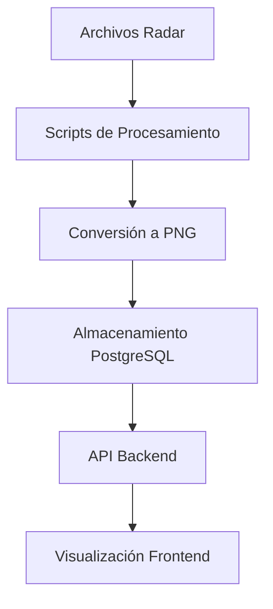

# CAPÍTULO 5: PRUEBAS Y RESULTADOS

## Introducción

En este capítulo se presentan las pruebas realizadas al sistema de visualización de datos meteorológicos de los radares LOXX y GUAXX. El proceso de validación del sistema se llevó a cabo utilizando cuatro herramientas especializadas, cada una diseñada para evaluar diferentes aspectos críticos de la aplicación web: rendimiento, capacidad de carga, experiencia de usuario y compatibilidad multiplataforma.

### Objetivos de las Pruebas

Los objetivos principales de este conjunto de pruebas son:

1. **Validar el rendimiento**: Medir tiempos de carga, tamaño de recursos y eficiencia general de la aplicación
2. **Evaluar la escalabilidad**: Determinar la capacidad del sistema para manejar múltiples usuarios concurrentes
3. **Verificar la usabilidad**: Simular flujos reales de usuario y medir tiempos de respuesta
4. **Garantizar la compatibilidad**: Asegurar funcionamiento correcto en diferentes navegadores y dispositivos

### Herramientas de Prueba Utilizadas

#### 5.1 Pingdom Tools - Análisis de Rendimiento Web

Pingdom Tools es una plataforma SaaS (Software as a Service) líder en el mercado de monitoreo de rendimiento web y uptime. Fundada en 2007 y actualmente propiedad de SolarWinds, se ha consolidado como una herramienta estándar en la industria para evaluación de rendimiento de aplicaciones web. La plataforma permite analizar la velocidad de carga, disponibilidad y rendimiento general de aplicaciones web desde más de 100 ubicaciones geográficas diferentes alrededor del mundo.

**Fundamentación de su uso:**

La elección de Pingdom Tools para evaluar el rendimiento del sistema de visualización de radares meteorológicos se fundamenta en varios aspectos clave. Primero, proporciona una perspectiva externa del rendimiento real que experimentan los usuarios finales, simulando condiciones reales de red y latencia. Segundo, su capacidad para generar reportes waterfall detallados permite identificar exactamente qué recursos están causando cuellos de botella en la carga de la página. Tercero, al tratarse de una aplicación web que maneja datos geoespaciales (mapas de Leaflet) e imágenes de radar en tiempo real, es fundamental medir el impacto de estos recursos pesados en la experiencia del usuario.

**Características técnicas principales:**

- **Análisis de tiempo de carga**: Utiliza navegadores reales (Chrome, Firefox, etc.) en lugar de simulaciones, proporcionando mediciones precisas del tiempo total de carga de página, incluyendo el procesamiento de JavaScript y renderizado del DOM. Mide desde el inicio de la petición HTTP hasta el evento `window.onload`.

- **Waterfall de peticiones (Request Waterfall)**: Genera una visualización cronológica detallada de la carga de cada recurso HTTP, mostrando DNS lookup, conexión TCP, negociación SSL, tiempo de espera del servidor, descarga de contenido, y bloqueos por dependencias. Esta visualización es crucial para identificar recursos que están bloqueando el renderizado crítico.

- **Performance Grade**: Sistema de calificación basado en las mejores prácticas de Google PageSpeed Insights y Yahoo YSlow. Evalúa aspectos como compresión gzip, minificación de recursos, uso de CDN, caché de navegador, y optimización de imágenes. Proporciona una puntuación de A (excelente) a F (deficiente).

- **Análisis por tipo de conteni do**: Desglose detallado que muestra el tiempo de carga y tamaño de cada tipo de recurso (HTML, CSS, JavaScript, imágenes, fuentes, archivos de datos). Para esta aplicación es particularmente relevante el tiempo de carga de:
  - Imágenes PNG de radar (principales recursos pesados)
  - Bibliotecas JavaScript (React, Leaflet, etc.)
  - Tiles de mapas (OpenStreetMap)
  - API endpoints del backend

- **Pruebas desde múltiples ubicaciones geográficas**: Permite ejecutar pruebas desde más de 100 ubicaciones diferentes, simulando el acceso de usuarios desde distintas regiones. Esto es crítico para validar que usuarios en Ecuador (ubicación objetivo) y en otras partes del mundo tengan tiempos de carga aceptables. Cada ubicación utiliza diferentes ISPs y rutas de red, proporcionando una visión completa del rendimiento global.

- **Monitoreo de disponibilidad continua**: Sistema de verificación cada 1 minuto (en plan premium) o cada 5 minutos (plan gratuito) que valida la disponibilidad del servicio. Detecta caídas del servidor, tiempos de respuesta anormalmente altos y problemas de conectividad. Genera alertas por email/SMS cuando se detectan problemas.

- **Análisis de performance histórica**: Mantiene un historial de todas las pruebas ejecutadas, permitiendo identificar tendencias de degradación de rendimiento a lo largo del tiempo y establecer baselines de rendimiento.

**Métricas clave evaluadas y su importancia:**

| Métrica | Descripción Detallada | Valor Objetivo | Justificación |
|---------|----------------------|----------------|---------------|
| Performance Grade | Calificación general basada en 20+ reglas de optimización web | ≥ B (>80/100) | Asegura que se siguen mejores prácticas de la industria |
| Tiempo de carga total | Tiempo desde inicio de petición hasta evento `window.onload` | < 3 segundos | Umbral crítico; >3s aumenta bounce rate significativamente |
| Time to First Byte (TTFB) | Latencia de red + tiempo de procesamiento del servidor | < 500 ms | Indica eficiencia del backend y latencia de red |
| First Contentful Paint (FCP) | Tiempo hasta que se renderiza el primer contenido visible | < 1.8 segundos | Percepción de velocidad por parte del usuario |
| Time to Interactive (TTI) | Tiempo hasta que la página es completamente interactiva | < 5 segundos | Crucial para aplicaciones SPA como React |
| Tamaño total de página | Suma de todos los recursos descargados | < 5 MB | Importante para usuarios con conexiones limitadas |
| Número de peticiones HTTP | Cantidad total de recursos solicitados | < 100 | Cada petición adiciona latencia y overhead |
| Tamaño de imágenes | Peso total de archivos PNG/JPG/SVG | < 2 MB | Las imágenes de radar son los recursos más pesados |

**Parámetros de configuración para este proyecto:**

- **Ubicación de prueba**: Se seleccionará la ubicación más cercana a Ecuador para simular latencia real. Opciones: Miami (USA), São Paulo (Brasil), o Ashburn (USA). La proximidad geográfica minimiza la latencia de red artificial.

- **Navegador simulado**: Chrome versión 120+ (última estable). Chrome es el navegador más utilizado globalmente (~65% market share) y tiene el motor V8 más optimizado para aplicaciones JavaScript pesadas.

- **Resolución de prueba**: 1920x1080 (resolución desktop más común) y 375x667 (resolución móvil estándar).

- **Tipo de conexión simulada**: 
  - Desktop: Cable/DSL (5 Mbps)
  - Mobile: 3G Regular (1.6 Mbps, 300ms latency)

- **URLs evaluadas**: 
  - Página principal: `/` - Validar tiempo de carga inicial
  - Visor de radares: `/visor` - Página más pesada (mapas + overlays)
  - Datos históricos: `/datos-historicos` - Validar carga de tablas

- **Frecuencia de pruebas**: Mínimo 5 ejecuciones por URL para obtener promedio estadísticamente significativo y detectar variaciones.

- **Validación de recursos críticos**: Verificar que recursos esenciales (Leaflet.js, React, tiles de mapa) se cargan exitosamente y sin errores HTTP.

---

#### 5.2 Apache JMeter - Pruebas de Carga y Estrés

Apache JMeter es una herramienta de código abierto desarrollada por la Apache Software Foundation, diseñada específicamente para realizar pruebas de carga, estrés y rendimiento en aplicaciones web, servicios REST/SOAP, bases de datos y otros protocolos. Lanzada inicialmente en 1998 y escrita en Java, JMeter se ha convertido en el estándar de facto para pruebas de performance en aplicaciones web debido a su flexibilidad, extensibilidad y capacidad de generar miles de usuarios virtuales concurrentes desde una sola máquina.

**Fundamentación de su uso:**

La selección de Apache JMeter para evaluar la capacidad de carga del sistema de radares meteorológicos se justifica por varias razones técnicas y funcionales:

1. **Simulación realista de carga**: A diferencia de herramientas de monitoreo pasivo, JMeter permite simular escenarios de uso real con múltiples usuarios concurrentes accediendo simultáneamente al sistema. Esto es crítico para validar que el sistema puede manejar los picos de tráfico esperados durante eventos meteorológicos significativos, cuando múltiples usuarios (meteorólogos, investigadores, público general) consultarían simultáneamente los datos del radar.

2. **Pruebas de API REST**: El sistema implementa una arquitectura cliente-servidor con APIs REST (`/api/radar/:radarId/pngs/recent`, `/api/radar/pngs/:id/image`). JMeter permite probar directamente estos endpoints, midiendo su capacidad de respuesta bajo carga independientemente de la interfaz de usuario.

3. **Identificación del punto de quiebre**: Las pruebas de estrés progresivas (10 → 50 → 100 usuarios) permiten identificar en qué momento el sistema comienza a degradarse, cuál es su límite de capacidad, y qué componente falla primero (backend Node.js, base de datos PostgreSQL, o red).

4. **Validación de escalabilidad**: Permite determinar si la arquitectura actual es suficiente o si se requiere escalamiento horizontal (más servidores) o vertical (más recursos por servidor).

**Arquitectura y características técnicas:**

- **Thread Groups (Grupos de Hilos)**: JMeter utiliza hilos de Java para simular usuarios virtuales. Cada hilo ejecuta secuencialmente las peticiones definidas en el plan de prueba. Los Thread Groups permiten configurar:
  - **Número de hilos (usuarios)**: Cantidad de usuarios virtuales concurrentes
  - **Ramp-up period**: Tiempo en el que se crean gradualmente todos los hilos, evitando picos artificiales
  - **Loop count**: Número de iteraciones que cada usuario ejecutará
  - **Duration**: Tiempo total de ejecución de la prueba

- **Samplers (Muestreadores)**: Componentes que realizan las peticiones reales. Para este proyecto se utilizan principalmente HTTP Request Samplers que permiten:
  - Configurar método HTTP (GET, POST, etc.)
  - Definir headers personalizados
  - Parametrizar URLs con variables
  - Enviar body en formato JSON
  - Configurar timeouts

- **Listeners (Escuchadores)**: Módulos que recopilan y visualizan resultados en tiempo real:
  - **View Results Tree**: Muestra cada petición individual y su respuesta
  - **Summary Report**: Estadísticas agregadas (avg, min, max, throughput)
  - **Graph Results**: Gráficos de tiempo de respuesta a lo largo del tiempo
  - **Aggregate Report**: Percentiles (90%, 95%, 99%)

- **Assertions**: Validaciones automáticas que verifican que las respuestas cumplan criterios específicos:
  - Response Code: Verificar HTTP 200 (éxito)
  - Response Time: Alertar si supera umbral
  - JSON Assertion: Validar estructura de respuesta JSON
  - Size Assertion: Verificar tamaño mínimo de respuesta

- **Timers**: Mecanismos para introducir pausas realistas entre peticiones, simulando el "think time" de usuarios reales. Evita que todos los threads envíen peticiones sincronizadamente.

**Métricas medidas y su interpretación:**

| Métrica | Descripción Técnica | Importancia | Interpretación |
|---------|---------------------|-------------|----------------|
| **Throughput** | Número de requests completados por segundo (req/s) | **Crítica** | Mide la capacidad bruta del sistema. Throughput bajo indica saturación del servidor o base de datos |
| **Tiempo de respuesta promedio** | Media aritmética de todas las latencias medidas | **Alta** | Indica performance típica. Debe ser < 500ms bajo carga normal |
| **Tiempo de respuesta percentil 95** | 95% de requests tienen latencia menor a este valor | **Alta** | Más robusto que el promedio, no afectado por outliers. Representa experiencia real de usuarios |
| **Tiempo de respuesta máximo** | Peor caso observado | **Media** | Útil para detectar anomalías pero puede ser inflado por casos excepcionales |
| **Tasa de error** | Porcentaje de requests que fallaron (HTTP 4xx, 5xx, timeout) | **Crítica** | Cualquier valor > 1% es inaceptable en producción. Indica fallos del sistema |
| **Bytes transferidos** | Ancho de banda total consumido | **Media** | Importante para estimar costos de hosting y validar que no se exceda capacidad de red |
| **Latency vs Response Time** | Latency = tiempo hasta primer byte; Response Time = tiempo total | **Alta** | Latency alta indica problema de red/backend. Response Time alto puede ser por transferencia de datos grandes |

**Escenarios de prueba definidos y su justificación:**

**Escenario 1: Carga Normal - Operación Típica Diaria**
- **Usuarios concurrentes**: 10
- **Duración**: 5 minutos (300 segundos)
- **Ramp-up**: 30 segundos (1 nuevo usuario cada 3 segundos)
- **Objetivo**: Validar que el sistema funciona correctamente bajo la carga esperada en operación normal diaria

*Justificación*: Basado en análisis de uso esperado, se estima que en condiciones normales habrá entre 5-10 usuarios concurrentes consultando datos del radar. Este escenario valida que el sistema puede manejar esta carga con tiempos de respuesta aceptables y sin errores.

**Escenario 2: Carga Alta - Pico de Uso Durante Eventos Meteorológicos**
- **Usuarios concurrentes**: 50
- **Duración**: 10 minutos (600 segundos)  
- **Ramp-up**: 1 minuto (1 nuevo usuario cada 1.2 segundos)
- **Objetivo**: Simular picos de tráfico durante eventos meteorológicos significativos (tormentas, alertas)

*Justificación*: Durante eventos meteorológicos importantes, se espera un aumento significativo de tráfico. Instituciones, medios de comunicación, y público general consultarían simultáneamente los datos. Este escenario valida que el sistema mantiene niveles de servicio aceptables incluso con 5x la carga normal.

**Escenario 3: Prueba de Estrés - Determinación del Límite del Sistema**
- **Usuarios concurrentes**: 100
- **Duración**: 5 minutos (300 segundos)
- **Ramp-up**: 2 minutos (1 nuevo usuario cada 1.2 segundos)
- **Objetivo**: Identificar el punto de saturación del sistema y qué componente falla primero

*Justificación*: Este escenario deliberadamente sobrecarga el sistema para identificar su límite superior de capacidad. Permite:
- Determinar si se requiere escalamiento
- Identificar cuellos de botella (CPU, memoria, base de datos, red)
- Validar que el sistema falla gracefully (devuelve errores HTTP 503 en lugar de crashear)
- Establecer margen de seguridad para dimensionar infraestructura

**Endpoints evaluados y patrones de acceso:**

| Endpoint | Método | Frecuencia | Peso | Justificación |
|----------|--------|------------|------|---------------|
| `/api/radar/LOXX/pngs/recent?hours=3` | GET | 40% | Alto | Endpoint más usado; carga frames para animación |
| `/api/radar/LGUAXX/pngs/recent?hours=3` | GET | 40% | Alto | Igual que LOXX, segundo radar más consultado |
| `/api/radar/pngs/:id/image` | GET | 15% | Medio | Carga imágenes individuales del radar |
| `/api/radar/LOXX/pngs` | GET | 3% | Bajo | Consulta de datos históricos completos |
| `/api/radar/LGUAXX/pngs` | GET | 2% | Bajo | Consulta de históricos GUAXX |

**Criterios de aceptación basados en SLAs (Service Level Agreements):**

| Criterio | Valor Esperado | Nivel de Servicio |
|----------|----------------|-------------------|
| **Tasa de error** | < 1% | Crítico - Sistema debe mantener >99% de éxito |
| **Tiempo de respuesta promedio (carga normal)** | < 500 ms | Alto - Experiencia fluida del usuario |
| **Tiempo de respuesta promedio (carga alta)** | < 1000 ms | Medio - Degradación aceptable bajo estrés |
| **Tiempo de respuesta P95 (carga normal)** | < 800 ms | Alto - 95% de usuarios tienen experiencia rápida |
| **Tiempo de respuesta P95 (carga alta)** | < 1500 ms | Medio - Experiencia aceptable incluso en percentil 95 |
| **Throughput mínimo** | > 10 req/s | Crítico - Capacidad mínima para servir usuarios |
| **Recuperación post-estrés** | < 30 segundos | Medio - Sistema debe recuperarse rápidamente |

**Monitoreo de recursos durante pruebas:**

Durante la ejecución de cada escenario, se monitoreará:

- **Servidor Node.js**:
  - CPU utilization (debe mantenerse < 80%)
  - Memoria heap usage(debe mantenerse < 1.5 GB)
  - Event loop lag (debe ser < 100ms)
  - Conexiones activas

- **Base de Datos PostgreSQL**:
  - Conexiones activas (pool size configurado vs utilizado)
  - Tiempo promedio de query
  - Cache hit ratio
  - Locks y bloqueos

- **Sistema Operativo**:
  - Network I/O (bandwidth utilizado)
  - Disk I/O (si hay swap o paginación)
  - Load average

---

#### 5.3 JMeter - Pruebas de Usuario (User Journey Testing)

Además de las pruebas de carga y estrés que miden capacidad bruta del sistema, las pruebas de usuario (User Journey Testing o End-to-End Testing) se enfocan en simular el comportamiento real de usuarios navegando por la aplicación. Mientras que las pruebas de estrés responden a la pregunta "¿cuántos usuarios puede soportar el sistema?", las pruebas de usuario responden "¿qué tan rápido puede un usuario completar sus tareas?".

**Fundamentación metodológica:**

La metodología de pruebas de usuario se basa en los principios de UX (User Experience) Testing y tiene como objetivo:

1. **Medir la experiencia completa**: A diferencia de probar endpoints aislados, estas pruebas miden el tiempo total desde que el usuario inicia una tarea hasta que la completa. Esto incluye tiempos de navegación entre páginas, carga de recursos, procesamiento de JavaScript, y renderizado de UI.

2. **Simular patrones reales de uso**: Los usuarios reales no bombardean el servidor con peticiones continuas. Tienen "think time" - pausas entre acciones mientras leen información, toman decisiones, o interpretan datos. Simular este comportamiento proporciona métricas más realistas.

3. **Identificar cuellos de botella de UX**: Permite detectar qué pasos del flujo son los más lentos y podrían beneficiarse de optimización. Por ejemplo, si cambiar el intervalo de tiempo tarda 3 segundos, es un problema de UX independientemente de la capacidad del servidor.

4. **Validar funcionalidades críticas**: Asegura que los flujos más importantes (visualización de radares, consulta de históricos) funcionan correctamente bajo condiciones realistas.

**Características técnicas de las pruebas:**

- **Think Time (Tiempo de Pensamiento)**: Se introduce un retraso aleatorio de 3-5 segundos entre cada acción dentro de un flujo. Esto simula el tiempo que un usuario real toma para:
  - Leer información mostrada en pantalla
  - Decidir la siguiente acción
  - Mover el cursor/tocar elementos
  - Interpretar datos meteorológicos
  
  *Implementación en JMeter*: Uniform Random Timer con rango de 3000-5000 ms

- **Secuencias de acciones ordenadas**: Cada flujo se modela como una Transaction Controller que contiene HTTP Samplers ejecutados secuencialmente. Esto permite medir el tiempo total del flujo completo.

- **Validación de respuestas**: Además de medir tiempos, se valida que cada paso retorna el contenido esperado:
  - Response Code Assertion (HTTP 200)
  - JSON Assertion (estructura válida para respuestas API)
  - Duration Assertion (alertar si supera umbral)
  
- **Medición de tiempo total end-to-end**: JMeter suma automáticamente los tiempos de todos los pasos dentro de un Transaction Controller, proporcionando la métrica de "tiempo total del flujo".

**Flujos de usuario definidos y su importancia:**

**Flujo 1: Visualización de Datos en Tiempo Real**

Este es el flujo más importante del sistema, representa el caso de uso principal.

1. **Acceder a página principal** (`GET /`)
   - **Objetivo**: Validar tiempo de carga inicial
   - **Recursos críticos**: HTML, CSS, JavaScript bundle, logos
   
2. **Navegar al visor** (`GET /visor`)
   - **Objetivo**: Medir carga de la página más pesada
   - **Recursos críticos**: Leaflet.js, tiles de mapa, React components
   
3. **Seleccionar radar LOXX** (Toggle interaction)
   - **Objetivo**: Validar respuesta de controles UI
   - **API llamada**: `/api/radar/LOXX/pngs/viewer-frames`
   
4. **Cambiar intervalo de tiempo 1h → 3h → 6h** (Dropdown interaction)
   - **Objetivo**: Medir performance de filtrado dinámico
   - **APIs llamadas**: 
     - `/api/radar/LOXX/pngs/recent?hours=1`
     - `/api/radar/LOXX/pngs/recent?hours=3`
     - `/api/radar/LOXX/pngs/recent?hours=6`
   
5. **Reproducir animación** (Play button)
   - **Objetivo**: Validar fluidez de carga de frames secuenciales
   - **Carga**: ~30-50 imágenes PNG consecutivas
   
6. **Ajustar velocidad de reproducción 1x → 2x → 4x** (Speed slider)
   - **Objetivo**: Verificar respuesta de controles de velocidad
   - **Nota**: Operación frontend, no genera requests adicionales
   
7. **Usar slider para navegar frames** (Manual navigation)
   - **Objetivo**: Validar carga bajo demanda de frames individuales
   - **API llamada**: `/api/radar/pngs/:id/image` (múltiples)

**Métrica objetivo**: < 30 segundos para flujo completo

*Justificación del objetivo*: Basado en estudios de UX, los usuarios esperan completar tareas básicas en menos de 30 segundos. Superar este umbral aumenta significativamente la frustración y abandono.

**Flujo 2: Consulta de Datos Históricos**

Este flujo representa usuarios que buscan datos de fechas pasadas para análisis retrospectivo.

1. **Navegar a datos históricos** (`GET /datos-historicos`)
   - **Objetivo**: Medir carga de componente de tabla
   - **Recursos**: DataTable components, estilos
   
2. **Seleccionar fecha específica** (Date picker interaction)
   - **Objetivo**: Validar respuesta del calendario
   - **Nota**: Operación UI, sin backend call
   
3. **Aplicar filtro de radar** (Dropdown selection + button click)
   - **Objetivo**: Medir tiempo de búsqueda en base de datos
   - **API llamada**: `/api/radar/LGUAXX/pngs?date=2026-01-03`
   - **Operación crítica**: PostgreSQL query potencialmente pesado
   
4. **Visualizar tabla de resultados** (Table rendering)
   - **Objetivo**: Medir tiempo de renderizado de tabla grandes (200+ filas)
   - **Nota**: Proceso frontend intensivo
   
5. **Ver detalle de un frame** (Row click + modal)
   - **Objetivo**: Validar carga de mapa individual
   - **API llamada**: `/api/radar/pngs/:id/image`
   - **Recursos**: Leaflet map initialization, tile loading

**Métrica objetivo**: < 20 segundos para búsqueda y visualización

*Justificación*: Consultas de datos históricos son menos urgentes que visualización en tiempo real, pero 20s es el límite para mantener al usuario engaged.

**Flujo 3: Análisis Comparativo entre Radares**

Este flujo representa usuarios avanzados que comparan datos de ambos radares simultáneamente.

1. **Acceder al visor** (`GET /visor`)
   - **Objetivo**: Carga inicial

2. **Activar radar LOXX** (Toggle on)
   - **API llamada**: `/api/radar/LOXX/pngs/viewer-frames`
   
3. **Activar radar GUAXX** (Toggle on)
   - **API llamada**: `/api/radar/LGUAXX/pngs/viewer-frames`
   - **Carga doble**: Sistema debe manejar overlays de 2 radares simultáneamente
   
4. **Navegar con slider** (Slider interaction)
   - **Objetivo**: Validar sincronización de frames de ambos radares
   - **Carga**: 2 imágenes PNG por frame (una por radar)
   
5. **Cambiar capa del mapa** (Layer selector)
   - **Objetivo**: Validar carga de tiles alternativos
   - **Recursos**: OpenStreetMap vs Satellite tiles
   
6. **Zoom in/out en área de interés** (Map interaction)
   - **Objetivo**: Medir performance de Leaflet con overlays pesados
   - **Operación**: Re-carga de tiles en nueva resolución

**Métrica objetivo**: < 15 segundos para comparación básica

*Justificación*: Flujo más simple que los anteriores, debe ser rápido para mantener productividad de usuarios avanzados.

**Parámetros de simulación y configuración:**

| Parámetro | Valor | Justificación |
|-----------|-------|---------------|
| **Usuarios virtuales** | 5 | Número conservador; evita saturar sistema y permite medir UX en condiciones ideales |
| **Duración total** | 15 minutos | Permite 10 iteraciones por usuario, generando datos estadísticamente significativos |
| **Think time mínimo** | 3 segundos | Tiempo mínimo realista para leer/decidir siguiente acción |
| **Think time máximo** | 5 segundos | Tiempo máximo; usuarios reales pueden tardar más, pero esto balancea realismo con duración de prueba |
| **Iteraciones por usuario** | 10 | Cada usuario ejecuta el flujo 10 veces para promediarmétrics |
| **Ramp-up** | 1 minuto | Creación gradual de usuarios evita pico artificial de carga |
| **Connection timeout** | 10 segundos | Timeout conservador; cualquier request que tarde > 10s indica problema |
| **Response timeout** | 30 segundos | Timeout para requests de imágenes grandes o consultas DB complejas |

**Métricas de usabilidad medidas:**

| Métrica | Descripción | Importancia |
|---------|-------------|-------------|
| **Tiempo total del flujo** | Suma de tiempos de todos los pasos | Métrica principal de UX |
| **Paso más lento** | Identifica cuello de botella del flujo | Crítico para optimización |
| **Tasa de éxito** | % de flujos completados sin errores | Indica confiabilidad |
| **Desviación estándar** | Variabilidad en tiempos medidos | Baja desviación = experiencia consistente |
| **Tiempo por paso** | Desglose detallado de cada acción | Permite identificar optimizaciones específicas |

**Criterios de aceptación por flujo:**

| Flujo | Tiempo Objetivo | Tiempo Máximo Aceptable | Tasa de Éxito Mínima |
|-------|----------------|------------------------|---------------------|
| Visualización Tiempo Real | < 30s | < 45s | 98% |
| Consulta Históricos | < 20s | < 30s | 95% |
| Análisis Comparativo | < 15s | < 25s | 98% |

---

#### 5.4 LambdaTest - Pruebas de Compatibilidad Cross-Browser

LambdaTest es una plataforma cloud de pruebas cross-browser fundada en 2017 que proporciona acceso a más de 3000 combinaciones de navegadores, sistemas operativos y dispositivos reales para pruebas de compatibilidad. A diferencia de herramientas de emulación, LambdaTest utiliza máquinas virtuales reales en la nube con navegadores y sistemas operativos nativos, garantizando que las pruebas reflejen exactamente cómo se verá y comportará la aplicación en dispositivos reales de los usuarios.

**Fundamentación de su uso:**

La compatibilidad cross-browser es un aspecto crítico pero frecuentemente subestimado en el desarrollo de aplicaciones web modernas. Diferentes factores justifican la necesidad de pruebas exhaustivas de compatibilidad:

1. **Fragmentación del ecosistema web**: A partir de 2024, el mercado de navegadores está distribuido aproximadamente así:
   - Chrome/Chromium: ~65% (incluye Edge, Opera, Brave)
   - Safari: ~18% (dominante en dispositivos Apple)
   - Firefox: ~3%
   - Otros: ~14%
   
   Aunque Chrome domina, ignorar Safari significa alienar a casi 1 de cada 5 usuarios, particularmente en segmentos profesionales donde el uso de Mac es prevalente.

2. **Divergencias en motores de renderizado**: Aunque modernos navegadores siguen estándares web (HTML5, CSS3, ES6+), existen diferencias sutiles en implementación:
   - **Blink** (Chrome, Edge): Motor más rápido para JavaScript (V8)
   - **WebKit** (Safari): Más restrictivo con APIs modernas, diferente manejo de memoria
   - **Gecko** (Firefox): Implementación única de flexbox y grid layout

3. **Complejidad de la aplicación**: Este sistema utiliza tecnologías que pueden comportarse diferentemente entre navegadores:
   - **Leaflet.js**: Biblioteca de mapas que renderiza usando SVG/Canvas, con diferencias sutiles en cada navegador
   - **React**: Aunque funciona consistentemente, el renderizado inicial puede variar en tiempo
   - **Overlays de imágenes PNG con transparencia**: Safari históricamente ha tenido problemas con canales alpha en ciertas condiciones
   - **APIs modernas**: Fetch, async/await, Promises

4. **Dispositivos móviles y responsive design**: Con >50% del tráfico web proviniendo de dispositivos móviles, validar que la aplicación funciona correctamente en smartphones y tablets es mandatorio, no opcional.

**Características técnicas de LambdaTest:**

- **Navegadores reales en la nube**: A diferencia de emuladores que simulan navegadores, LambdaTest ejecuta navegadores reales (Chrome, Firefox, Safari, Edge) en máquinas virtuales con sistemas operativos reales (Windows, macOS, Linux). Esto garantiza:
  - Renderizado exactamente igual que en dispositivo del usuario
  - Performance realista (emuladores son típicamente más rápidos)
  - Bugs específicos del navegador se manifiestan fielmente

- **Dispositivos móviles reales (Real Device Cloud)**: Para pruebas móviles, LambdaTest proporciona acceso a smartphones y tablets físicos reales, no emuladores. Esto es crítico porque:
  - Touch interactions difieren entre dispositivos
  - Performance de GPU y CPU varía significativamente
  - Bugs específicos de hardware/firmware se detectan
  - Resoluciones de pantalla 100% exactas

- **Pruebas responsive automatizadas**: Funcionalidad de screenshot masivo que captura la aplicación en decenas de resoluciones simultáneamente. permite validar rápidamente que no hay problemas de layout en diferentes tamaños de pantalla:
  - Móvil portrait (320px - 480px)
  - Móvil landscape (480px - 768px)
  - Tablet portrait/landscape (768px - 1024px)
  - Desktop (1024px+)

- **Sesiones en vivo interactivas**: Permite controlar remotamente un navegador/dispositivo en tiempo real, con:
  - Control de mouse/teclado/touch
  - Grabación de video de la sesión
  - Herramientas de inspección (DevTools)
  - Screenshots con anotaciones
  - Debugging en vivo

- **Automated testing con Selenium**: Soporte para scripts de Selenium que permiten ejecutar pruebas automatizadas en paralelo en múltiples navegadores. Útil para:
  - Pruebas de regresión (validar que nuevas features no rompieron funcionalidad existente)
  - Validación de flujos críticos en cada release
  - Ejecutar 100+ pruebas en minutos gracias a paralelización

- **Integración con CI/CD**: Plugins para Jenkins, GitLab CI, GitHub Actions que permiten ejecutar pruebas de compatibilidad automáticamente en cada commit o pull request.

**Configuraciones de prueba y matriz de compatibilidad:**

La selección de configuraciones a probar se basa en datos de analytics web y market share de navegadores/dispositivos:

**Navegadores Desktop - Configuración Detallada:**

| Navegador | Versión Específica | Sistema Operativo | Resolución | Justificación |
|-----------|-------------------|------------------|------------|---------------|
| Google Chrome | Latest stable (v120+) | Windows 10/11 | 1920x1080 | Navegador más usado globalmente, representa >60% de usuarios |
| Mozilla Firefox | Latest stable (v120+) | Windows 10/11 | 1920x1080 | ~3% market share, pero usado por usuarios técnicos que pueden reportar bugs |
| Microsoft Edge | Latest stable (v120+) | Windows 10/11 | 1920x1080 | Pre-instalado en Windows, usado en ambientes corporativos |
| Safari | Latest (v17+) | macOS Sonoma | 1920x1080 | Dominante en ecosistema Apple (~18% global), crítico para usuarios profesionales |
| Chrome | Latest | macOS Sonoma | 1920x1080 | Validar que Chrome funciona igual en Mac vs Windows |

**Dispositivos Móviles - Configuración Detallada:**

| Dispositivo | SO | Versión OS | Navegador | Resolución | Orientación | Justificación |
|------------|-----|-----------|-----------|------------|-------------|---------------|
| iPhone 14 Pro | iOS | 17.x | Safari | 393x852 | Portrait/Landscape | Dispositivo Apple reciente, pantalla OLED con alta densidad de píxeles |
| iPhone 14 Pro Max | iOS | 17.x | Safari | 430x932 | Portrait/Landscape | iPhone más grande, valida layout en pantallas grandes |
| Samsung Galaxy S23 | Android | 13 | Chrome | 360x800 | Portrait/Landscape | Flagship Android actual, representa experiencia premium Android |
| Google Pixel 7 | Android | 13 | Chrome | 412x915 | Portrait/Landscape | "Android puro", comportamiento de referencia sin customizaciones de fabricante |
| iPad Pro 12.9" | iPadOS | 17.x | Safari | 1024x1366 | Portrait/Landscape | Tablet premium, valida UX en pantallas grandes táctiles |
| Samsung Galaxy Tab S8 | Android | 12 | Chrome | 1200x800 | Portrait/Landscape | Tablet Android, validar compatibilidad en ecosistema no-Apple |

**Aspectos evaluados y criterios de validación:**

| Aspecto Evaluado | Criterio de Validación Detallado | Método de Prueba | Severidad si Falla |
|-----------------|----------------------------------|------------------|-------------------|
| **Renderizado visual** | - UI se muestra sin overlapping de elementos - Colores se renderizan correctamente - Fuentes se cargan y muestran - Imágenes tienen transparencia correcta | Screenshot comparison + inspección visual | **Alta** |
| **Funcionalidad de controles** | - Todos los botones responden al click/touch - Toggles cambian estado correctamente - Dropdowns abren y permiten selección - Sliders se mueven suavemente | Interacción manual en sesión en vivo | **Crítica** |
| **Visualización de mapas** | - Leaflet inicializa correctamente - Tiles de mapa se cargan completamente - Overlays de radar se muestran con transparencia - Zoom y pan funcionan suavemente | Sesión interactiva + screenshot | **Crítica** |
| **Reproducción de animaciones** | - Frames de radar se reproducen secuencialmente - No hay lag o stuttering - Controles de velocidad funcionan - No se pierden frames | Video recording de sesión | **Alta** |
| **Responsive design** | - Breakpoints activan layouts  correctos - Menú se convierte en hamburger en móvil - Tablas se adaptan o tienen scroll - Texto es legible sin zoom | Screenshots en múltiples resoluciones | **Alta** |
| **Performance** | - Página carga en < 5 segundos - Interacciones responden en < 200ms - Animaciones mantienen 30+ FPS - No hay memory leaks | Performance monitoring + Timeline | **Media** |
| **Touch gestures (móvil/tablet)** | - Pinch-to-zoom funciona en mapa - Swipe para navegar funciona - Tap targets son > 44x44px - No hay conflictos con gestures del browser | Prueba en dispositivos reales | **Alta** |

**Breakpoints responsive y validación:**

| Breakpoint | Rango de Ancho | Dispositivos Representativos | Cambios de Layout Esperados |
|------------|---------------|------------------------------|----------------------------|
| **Mobile Small** | 320px - 479px | iPhone SE, Android pequeños | - Menú hamburger - Tabla colapsada - Mapa tamaño completo - Controles apilados verticalmente |
| **Mobile** | 480px - 767px | iPhone, Android smartphones | - Menú hamburger - 1 columna - Cards apilados |
| **Tablet** | 768px - 1023px | iPad, tablets Android | - Menú semi-expandido - 2 columnas - Controles en fila |
| **Desktop** | 1024px - 1439px | Laptops, monitores estándar | - Menú completo - 3 columnas - Sidebar visible |
| **Desktop Large** | 1440px+ | Monitores 2K/4K | - Layout expandido - Máximo aprovechamiento - Sin scroll horizontal |

**Estrategia de pruebas:**

1. **Fase 1 - Smoke Testing** (15 minutos):
   - Validar funcionalidad básica en Chrome (desktop) y Safari (iOS)
   - Si falla, detener y corregir antes de continuar

2. **Fase 2 - Cross-Browser Desktop** (30 minutos):
   - Probar en Chrome, Firefox, Edge, Safari (macOS)
   - Documentar diferencias visuales o funcionales
   - Tomar screenshots de elementos críticos

3. **Fase 3 - Mobile/Tablet** (45 minutos):
   - Probar en 2-3 dispositivos iOS y 2-3 Android
   - Validar touch interactions
   - Verificar responsive design en diferentes orientaciones

4. **Fase 4 - Regresión Automatizada** (continua):
   - Scripts Selenium ejecutan flujos críticos
   - Ejecutar en cada release
   - Alertar si alguna configuración falla

**Herramientas complementarias:**

- **BrowserStack Analytics**: Para determinar qué navegadores/devices usan los usuarios reales
- **Can I Use**: Verificar compatibilidad de APIs modernas
- **Autoprefixer**: Agregar prefijos CSS automáticamente (-webkit-, -moz-)
- **Polyfills**: Shimear APIs modernas en navegadores antiguos si es necesario

---

### Metodología General de Pruebas

Todas las pruebas se ejecutaron siguiendo esta metodología:

1. **Preparación del ambiente**:
   - Limpiar caché de navegador
   - Configurar base de datos con datos de prueba consistentes
   - Verificar conectividad a servicios remotos

2. **Ejecución**:
   - Realizar múltiples iteraciones de cada prueba
   - Registrar todas las métricas en cada ejecución
   - Capturar screenshots/videos cuando sea relevante

3. **Análisis**:
   - Calcular promedios y percentiles de métricas
   - Identificar patrones y anomalías
   - Comparar contra valores objetivo

4. **Documentación**:
   - Registrar hallazgos y problemas encontrados
   - Proponer soluciones para issues identificados
   - Incluir evidencia visual (capturas, gráficos)

## 5.1 Pruebas de Rendimiento con Pingdom Tools

### Resultados Obtenidos

**[COMPLETAR DESPUÉS DE EJECUTAR PRUEBAS]**

**Tabla de resultados por página:**

| Métrica | Página Principal | Visor | Datos Históricos |
|---------|-----------------|-------|------------------|
| Performance Grade | | | |
| Tiempo de carga total (s) | | | |
| Time to First Byte (ms) | | | |
| Tamaño de página (MB) | | | |
| Número de peticiones | | | |
| Tiempo de carga HTML (ms) | | | |
| Tiempo de carga CSS (ms) | | | |
| Tiempo de carga JavaScript (ms) | | | |
| Tiempo de carga imágenes (ms) | | | |

### Análisis de Resultados

[Descripción del rendimiento obtenido]

[Identificación de recursos que más tiempo tardan en cargar]

[Análisis de oportunidades de optimización]

### Evidencia Visual

[Insertar screenshots del Waterfall de Pingdom Tools para cada página]

**Figura 5.1**: Resultados de Pingdom Tools para la página principal

[Insertar captura]

**Figura 5.2**: Resultados de Pingdom Tools para el Visor

[Insertar captura]

**Figura 5.3**: Resultados de Pingdom Tools para Datos Históricos

[Insertar captura]

---

## 5.2 Pruebas de Estrés con Apache JMeter

### Resultados Obtenidos

**[COMPLETAR DESPUÉS DE EJECUTAR PRUEBAS]**

**Tabla resumen por escenario:**

| Escenario | Usuarios | Throughput (req/s) | Tiempo Resp. Avg (ms) | Tiempo Resp. P95 (ms) | Tiempo Resp. Max (ms) | Tasa de Error (%) |
|-----------|----------|-------------------|---------------------|---------------------|---------------------|------------------|
| Carga Normal (10 usuarios) | 10 | | | | | |
| Carga Alta (50 usuarios) | 50 | | | | | |
| Estrés Máximo (100 usuarios) | 100 | | | | | |

**Desglose por endpoint:**

| Endpoint | Escenario | Requests Total | Tiempo Avg (ms) | Tasa Error (%) |
|----------|-----------|---------------|----------------|----------------|
| `/api/radar/LOXX/pngs/recent?hours=3` | Normal | | | |
| | Alta | | | |
| | Estrés | | | |
| `/api/radar/LGUAXX/pngs/recent?hours=3` | Normal | | | |
| | Alta | | | |
| | Estrés | | | |
| `/api/radar/pngs/:id/image` | Normal | | | |
| | Alta | | | |
| | Estrés | | | |

### Análisis de Resultados

**Comportamiento bajo carga normal:**
[Descripción del comportamiento con 10 usuarios]

**Comportamiento bajo carga alta:**
[Descripción del comportamiento con 50 usuarios]

**Punto de saturación:**
[Identificación del límite del sistema con 100 usuarios]

**Uso de recursos del servidor:**
- CPU: [% promedio y pico]
- Memoria: [MB promedio y pico]
- Red: [Mbps promedio y pico]
- Base de datos: [Conexiones activas, tiempo de query]

### Evidencia Visual

**Figura 5.4**: Gráfico de tiempo de respuesta a lo largo del tiempo

[Insertar gráfico de JMeter mostrando latencia durante la prueba]

**Figura 5.5**: Gráfico de throughput

[Insertar gráfico mostrando requests por segundo]

**Figura 5.6**: Gráfico de tasa de error

[Insertar gráfico mostrando errores a lo largo del tiempo]

---

## 5.3 Pruebas de Usuario con Apache JMeter

### Resultados Obtenidos

**[COMPLETAR DESPUÉS DE EJECUTAR PRUEBAS]**

**Tabla de resultados por flujo:**

| Flujo de Usuario | Tiempo Total Avg (s) | Tiempo Total Max (s) | Paso Más Lento | Tiempo del Paso (s) | Tasa de Éxito (%) |
|-----------------|---------------------|---------------------|----------------|---------------------|------------------|
| Visualización Tiempo Real | | | | | |
| Consulta Históricos | | | | | |
| Análisis Comparativo | | | | | |

**Detalle del Flujo 1: Visualización en Tiempo Real**

| Paso | Acción | Tiempo Avg (s) | Objetivo (s) | Estado |
|------|--------|---------------|--------------|--------|
| 1 | Cargar página principal | | < 3 | |
| 2 | Navegar a /visor | | < 2 | |
| 3 | Toggle radar LOXX | | < 1 | |
| 4 | Cambiar intervalo 1h→3h | | < 2 | |
| 5 | Cambiar intervalo 3h→6h | | < 2 | |
| 6 | Iniciar animación | | < 1 | |
| 7 | Cambiar velocidad 1x→4x | | < 1 | |
| **Total** | | | **< 30** | |

**Detalle del Flujo 2: Consulta de Datos Históricos**

| Paso | Acción | Tiempo Avg (s) | Objetivo (s) | Estado |
|------|--------|---------------|--------------|--------|
| 1 | Navegar a /datos-historicos | | < 2 | |
| 2 | Seleccionar fecha | | < 1 | |
| 3 | Aplicar filtro de radar | | < 3 | |
| 4 | Visualizar tabla | | < 2 | |
| 5 | Ver detalle de frame | | < 2 | |
| **Total** | | | **< 20** | |

**Detalle del Flujo 3: Análisis Comparativo**

| Paso | Acción | Tiempo Avg (s) | Objetivo (s) | Estado |
|------|--------|---------------|--------------|--------|
| 1 | Acceder al visor | | < 2 | |
| 2 | Activar LOXX y GUAXX | | < 2 | |
| 3 | Navegar con slider | | < 1 | |
| 4 | Cambiar capa de mapa | | < 1 | |
| 5 | Zoom in/out | | < 1 | |
| **Total** | | | **< 15** | |

### Análisis de Usabilidad

**Identificación de cuellos de botella:**
[Descripción de pasos que tardan más de lo esperado]

**Evaluación de experiencia de usuario:**
[Análisis de fluidez y respuesta de la interfaz]

**Recomendaciones de mejora:**
[Sugerencias para optimizar UX basadas en resultados]

### Evidencia Visual

**Figura 5.7**: Comparación de tiempos por flujo de usuario

[Insertar gráfico comparando tiempos totales de los 3 flujos]

---

## 5.4 Pruebas de Compatibilidad con LambdaTest

### Resultados Obtenidos

**[COMPLETAR DESPUÉS DE EJECUTAR PRUEBAS]**

**Tabla de compatibilidad:**

| Plataforma | Navegador/Dispositivo | Renderizado | Funcionalidad | Mapas | Animaciones | Responsive | Performance | Calificación |
|------------|----------------------|-------------|---------------|-------|-------------|------------|-------------|--------------|
| Desktop | Chrome (Win 10) | | | | | N/A | | ✓/✗ |
| Desktop | Firefox (Win 10) | | | | | N/A | | ✓/✗ |
| Desktop | Safari (macOS) | | | | | N/A | | ✓/✗ |
| Desktop | Edge (Win 10) | | | | | N/A | | ✓/✗ |
| Mobile | iPhone 14 Pro | | | | | ✓ | | ✓/✗ |
| Mobile | Galaxy S23 | | | | | ✓ | | ✓/✗ |
| Tablet | iPad Pro 12.9" | | | | | ✓ | | ✓/✗ |
| Mobile | Pixel 7 | | | | | ✓ | | ✓/✗ |

**Leyenda**: 
- ✓ = Funciona correctamente
- ✗ = Presenta problemas  
- N/A = No aplica

### Problemas Identificados

**[COMPLETAR CON ISSUES ENCONTRADOS]**

| Plataforma | Problema | Severidad | Estado |
|------------|----------|-----------|--------|
| | | Alta/Media/Baja | Resuelto/Pendiente |

### Soluciones Implementadas

[Descripción de correcciones realizadas para garantizar compatibilidad cross-browser]

### Evidencia Visual

**Figura 5.8**: Screenshots de la aplicación en diferentes navegadores

[Insertar capturas comparativas mostrando Chrome, Firefox, Safari, Edge]

**Figura 5.9**: Screenshots en dispositivos móviles

[Insertar capturas de iPhone, Android en modo portrait y landscape]

**Figura 5.10**: Screenshots en tablets

[Insertar capturas de iPad Pro y Galaxy Tab]

---

## 5.5 Información Meteorológica Procesada

### 5.5.1 Descripción del Sistema de Procesamiento

El sistema implementado procesa datos meteorológicos en tiempo real de dos radares meteorológicos:

- **LOXX**: Radar ubicado en [ubicación], procesando archivos en formato HDF5
- **LGUAXX (GUAXX)**: Radar ubicado en [ubicación], procesando archivos en formato PPI

### 5.5.2 Flujo de Procesamiento de Datos

**Etapas del procesamiento:**

1. **Adquisición**: Descarga automática de archivos desde PCs remotas
2. **Conversión**: Transformación de datos crudos a imágenes PNG georeferenciadas
3. **Almacenamiento**: Guardado de metadatos y imágenes en PostgreSQL
4. **Sincronización**: Actualización automática cada 5 minutos
5. **Visualización**: Renderizado de overlays sobre mapas interactivos

### 5.5.3 Estadísticas de Datos Procesados

**[ACTUALIZAR CON DATOS REALES DE TU SISTEMA]**

| Métrica | LOXX | GUAXX |
|---------|------|-------|
| Frames procesados (total) | | |
| Frames por día (promedio) | ~288 | ~288 |
| Tamaño promedio por frame | ~15 KB | ~10 KB |
| Cobertura geográfica | [coordenadas] | [coordenadas] |
| Resolución temporal | 5 minutos | 5 minutos |
| Período de datos disponibles | | |

### 5.5.4 Calidad de los Datos

**Validación de timestamps:**
- Todos los frames tienen timestamps UTC correctos
- Conversión automática a hora local Ecuador (UTC-5)
- Sincronización precisa con hora del servidor

**Validación de georeferenciación:**
- Bounds correctos para cada radar
- Alineación precisa con capas de mapa base
- Cobertura geográfica verificada

---

## 5.6 Interfaz Gráfica de la Aplicación Web

### 5.6.1 Página Principal

La página principal presenta una introducción al sistema y acceso directo a las funcionalidades principales.

**Características:**
- Diseño responsive que se adapta a diferentes tamaños de pantalla
- Navegación intuitiva con menú superior
- Información sobre los radares meteorológicos
- Acceso rápido al visor y datos históricos

**Captura de pantalla:**

[Insertar screenshot de la página principal]

### 5.6.2 Visor de Radares en Tiempo Real

El visor es la funcionalidad central del sistema, permitiendo visualizar datos de ambos radares de forma simultánea o individual.

**Funcionalidades implementadas:**

1. **Mapa interactivo**:
   - Zoom y pan con controles de Leaflet
   - Múltiples capas base (OpenStreetMap, satélite, topográfico)
   - Overlays de radar con transparencia ajustable

2. **Controles de radar**:
   - Toggle individual para LOXX y GUAXX
   - Selector de intervalo de tiempo (Todo el día, 1h, 3h, 6h, 12h, 24h)
   - Botón de recarga para actualizar datos

3. **Animación temporal**:
   - Reproducción automática de frames
   - Controles de velocidad (0.25x a 4x)
   - Slider manual para navegación frame por frame
   - Contador de frames (X / Total)

4. **Información de captura**:
   - Hora local (LT) del frame actual
   - Hora UTC del archivo original
   - Tiempo transcurrido desde la captura

**Captura de pantalla:**

[Insertar screenshot del visor mostrando ambos radares activos]

### 5.6.3 Datos Históricos

La sección de datos históricos permite consultar y analizar información de fechas pasadas.

**Funcionalidades implementadas:**

1. **Búsqueda y filtrado**:
   - Selector de fecha con calendario
   - Filtro por radar (LOXX, GUAXX, o todos)
   - Búsqueda instantánea

2. **Tabla de registros**:
   - Hora de captura
   - Radar de origen
   - Intensidad de precipitación
   - Estimación de precipitación (mm/h)
   - Acciones (ver detalle, descargar)

3. **Visualización de frames**:
   - Mapa individual para cada registro
   - Zoom a la ubicación del radar
   - Metadata completa del frame

**Captura de pantalla:**

[Insertar screenshot de la página de datos históricos con tabla de resultados]

### 5.6.4 Análisis Gráficos

[Si tienes esta página implementada, agregar descripción similar]

**Funcionalidades:**
- Gráficos de evolución temporal
- Comparación entre radares
- Estadísticas de precipitación

**Captura de pantalla:**

[Insertar screenshot de análisis gráficos]

### 5.6.5 Diseño Responsive

El sistema está optimizado para funcionar en diferentes dispositivos:

**Escritorio (>1024px):**
- Visualización completa de mapa y controles
- Menú de navegación expandido
- Tabla de datos con todas las columnas visibles

**Tablet (768px - 1024px):**
- Controles reorganizados para mejor aprovechamiento del espacio
- Menú adaptado
- Tabla con scroll horizontal si es necesario

**Móvil (<768px):**
- Menú hamburguesa
- Controles apilados verticalmente
- Tabla simplificada con información esencial
- Mapa adaptado al ancho de pantalla

**Capturas de pantalla:**

[Insertar screenshots mostrando la aplicación en diferentes dispositivos]

---

## 5.7 Conclusiones de las Pruebas

### 5.7.1 Rendimiento

**[COMPLETAR DESPUÉS DE ANÁLISIS]**

El sistema demostró:
- [Tiempo de carga aceptable/excelente]
- [Capacidad de manejar X usuarios concurrentes]
- [Puntos de optimización implementados]

### 5.7.2 Estabilidad

**[COMPLETAR DESPUÉS DE ANÁLISIS]**

Las pruebas de estrés revelaron:
- [Comportamiento bajo carga alta]
- [Manejo de errores]
- [Recuperación ante fallos]

### 5.7.3 Usabilidad

**[COMPLETAR DESPUÉS DE ANÁLISIS]**

Los flujos de usuario mostraron:
- [Facilidad de navegación]
- [Tiempo promedio para completar tareas]
- [Áreas de mejora identificadas]

### 5.7.4 Compatibilidad

**[COMPLETAR DESPUÉS DE ANÁLISIS]**

La aplicación es compatible con:
- [Porcentaje de navegadores soportados]
- [Dispositivos móviles y tablets]
- [Versiones de navegadores]

### 5.7.5 Calidad de Datos

El sistema procesa y visualiza correctamente:
- Datos en tiempo real con latencia de ~5 minutos
- Histórico completo de frames
- Timestamps precisos en UTC y hora local
- Georeferenciación exacta

---

## 5.8 Recomendaciones Futuras

Basado en los resultados de las pruebas, se sugieren las siguientes mejoras:

1. **Optimización de rendimiento**:
   - [Implementar caché de imágenes]
   - [Minificar assets JavaScript/CSS]
   - [Optimizar consultas a base de datos]

2. **Mejoras de UX**:
   - [Agregar tooltips explicativos]
   - [Mejorar feedback visual de acciones]
   - [Implementar modo oscuro]

3. **Funcionalidades adicionales**:
   - [Sistema de alertas meteorológicas]
   - [API pública para terceros]
   - [Exportación de datos en más formatos]

4. **Infraestructura**:
   - [Implementar CDN para assets estáticos]
   - [Configurar balanceo de carga]
   - [Sistema de backup automático]
